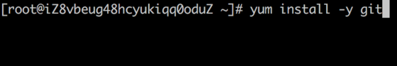
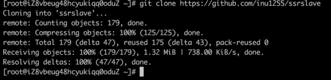
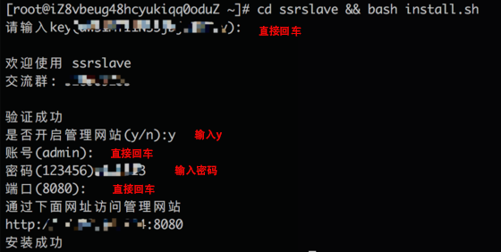
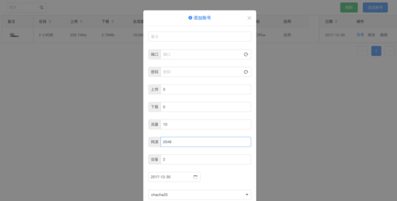
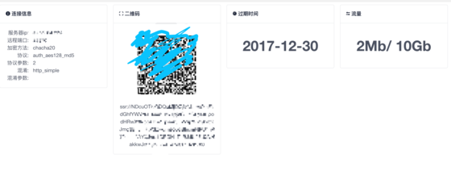

Base On https://github.com/shadowsocksr/shadowsocksr.git

目前只支持了centos一键安装

## 1. 安装方法

``` bash
# 没有安装git的?
yum install -y git
```

``` bash
git clone https://github.com/inu1255/ssrslave.git
```

``` bash
cd ssrslave && bash install.sh
# 根据提示输入，不知道的直接回车
```
  

## 2. 使用
打开安装成功上面一行的网址  

  

输入账号密码，默认账号`admin`,密码`123456`  

  

账号管理，支持  
1. 添加删除修改用户
2. 限速(单位Kb)
3. 限制流量(单位Gb)
4. 设置过期时间
5. 限制登录设备(最少为2个，设置1个无造成无法连接，在下才疏学浅，原因不明)


查看账号信息

1. 本页面不需要登录
2. 显示ssr连接信息，ssr二维码
3. 显示到期时间
4. 显示流量信息
